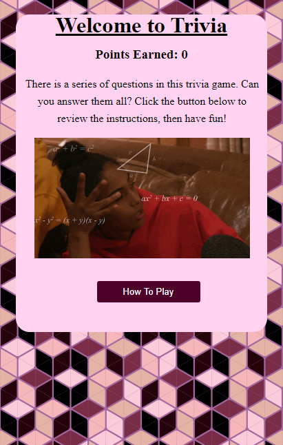

# Trivia

- Trivia is a multiple choice game in which the player selects the correct answer to satisfy the question that's asked of them. Correct answers add to a tally of points for the player, and incorrect answers offer brief education on the appropriate response so that the player can continue with the game.

- JavaScript, HTML, and CSS have been used in this page, and pushed through [HTML](https://html5.validator.nu/) and [CSS](https://jigsaw.w3.org/css-validator/) validators.

## Installation Instructions

- "For this project, clone and open the HTML file in a browser manually or on a server like LiveServer"

## User Stories

- As a player, I want information on why a selected answer is wrong, so that I earn educational benefit from this game.

- As a player, I want an entire sentence to be clickable, so that I don't need to aim for a small number or radio button to choose an answer.

- As a player, I want to know my tally of correct answers at the end of the game.

### MVP Goals

- Ability to choose one of three options to satisfy a question.

- A restart button at the end of the game so that the player can answer the questions again.

### Stretch Goals

- Animations for when a question is answered correctly

- Subtle background color change when moving on to a new question

- Pop-up hint "Are you sure you want to choose this?" if a player is about to choose a wrong answer

## Wireframes

## Challenges

- Designing a trivia game, the biggest hurdle was getting the choices to be responsive when the player wants to select one. I especially wanted to keep accessibility in mind for both mobile users and users who may not have the dexterity to aim for a small check box or radio button when choosing an answer.

- After making entire sentences clickable, I wanted to make it a little more obvious that the whole sentence could be clicked on by enveloping the entirety of a choice in a different color which stands out from the background.

## Screenshot

The layout is mobile responsive! It will resize itself accordingly with the size of the page. 